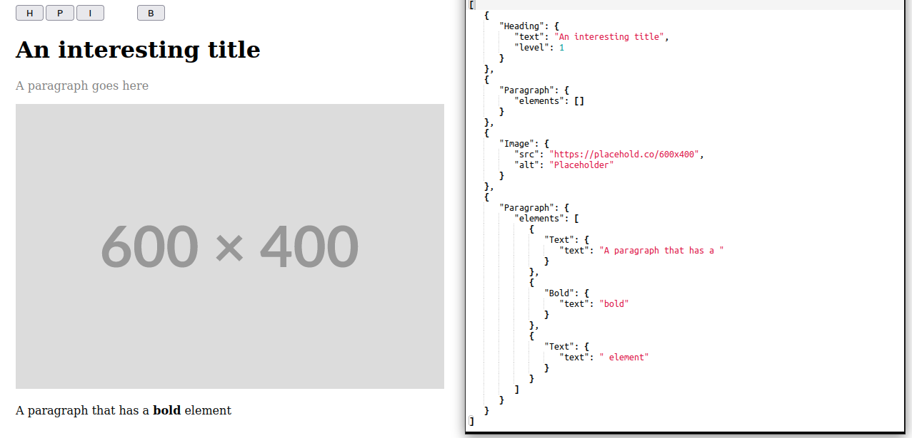

# edita
`edita` is a rust library for building headless block editors.
It allows you to create custom block editors tailored to your specific needs.



## Features
- Customizable Blocks: Define your own content processing blocks for various applications.
- Command Execution: Execute commands to modify the editor's internal state.
- Library agnostic: The core part of this lib has no dependencies allowing you to build on any framework.
- Exportable: Nodes can be exported in any serializable format or be simply be coerced to popular formats like json, markdown and html.

## Running
Currently edita is in active development so expect some breaking parts.
```shell
trunk serve
```
Check http://localhost:8000

## Using as a library

1. Add edita-core to your Cargo.toml:
```toml
[dependencies]
edita-core = "0.1.0"
```
2. Create an editor with custom state, blocks, and commands.
3. Use the editor to process and manipulate content.

## License

This project is licensed under the MIT License.

## Contributing

Contributions and ideas welcome. Feel free to open issues or submit pull requests on GitHub.